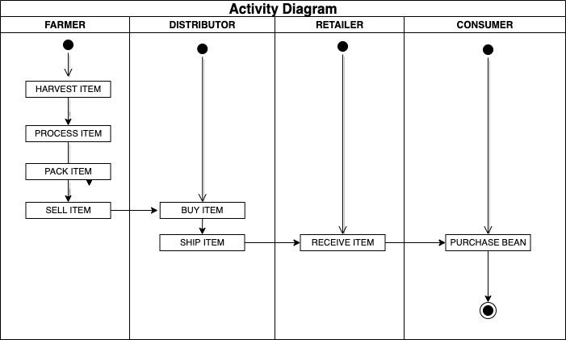
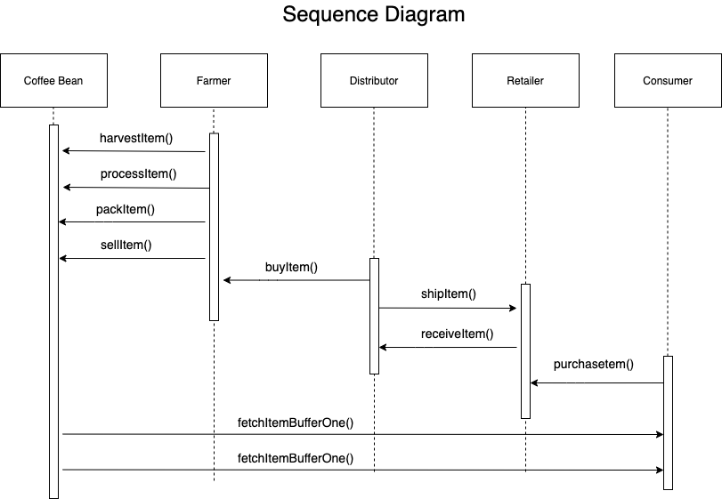
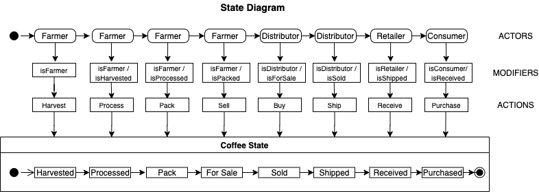
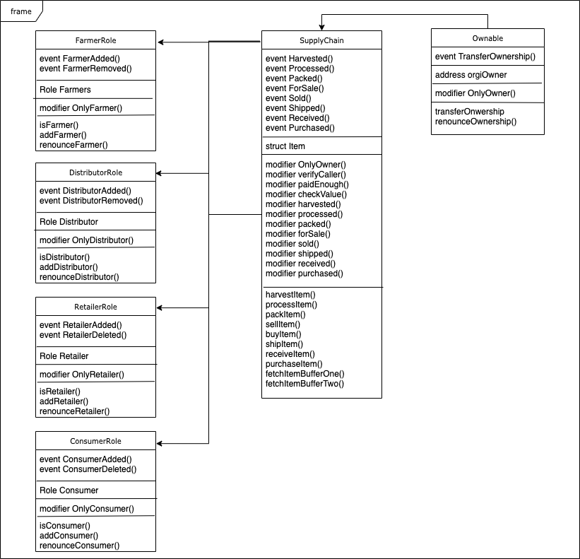
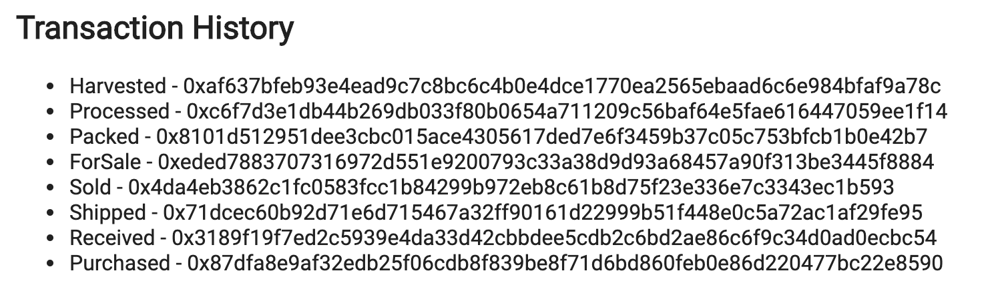
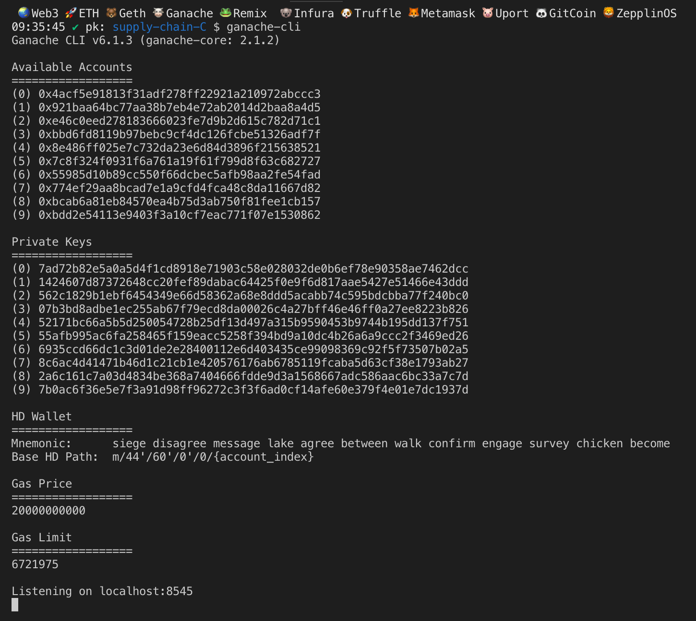

# Blockchain Supply Chain Solution - Coffee

This repository containts an Ethereum DApp that demonstrates a Supply Chain flow between a Seller and Buyer. The user story is similar to any commonly used supply chain process. A Seller can add items to the inventory system stored in the blockchain. A Buyer can purchase such items from the inventory system. Additionally a Seller can mark an item as Shipped, and similarly a Buyer can mark an item as Received.

## Rinkeby Trainsaction and Contract Address

```
   Deploying 'SupplyChain'
   -----------------------
   > transaction hash:    0xc89209321cd10bbbafb2de70955ca404fdbf35c1aa4c8412d5c6d5326c9f1f21
   > Blocks: 1            Seconds: 12
   > contract address:    0xF2a9CeCce462B0F6dFbACF2f3464361096dAE911
   > block number:        6428725
   > block timestamp:     1588586313
   > account:             0xc677420923196099E2e3feF15761dde98F3c90FF
   > balance:             18.548189447900000002
   > gas used:            2978733
   > gas price:           10 gwei
   > value sent:          0 ETH
   > total cost:          0.02978733 ETH
```

Link to the Contract: https://rinkeby.etherscan.io/address/0xF2a9CeCce462B0F6dFbACF2f3464361096dAE911

## Description

This project aims to solve the problem of tracking the full supply chain from the production of the coffee beans to the consumer hands.
This document uses UML to describre the general structure and functions that this Smart Contract offers to the actors:

- Farmers
- Distributors
- Retailers
- Consumers

## Activity Diagram

This diagram shows the different actors and the interactions with the system.



## Sequence Diagram

This diagram shows the communication between the different objects and their life cycle.



## State Diagram

This diagram shows the different states of each object and the events or conditions that change those states.



## Data Modeling Diagram

This diagram shows the different Smart Contracts and the relation between them



The DApp User Interface when running looks like...




## Getting Started

These instructions will get you a copy of the project up and running on your local machine for development and testing purposes. See deployment for notes on how to deploy the project on a live system.

### Prerequisites

Please make sure you've already installed ganache-cli, Truffle and enabled MetaMask extension in your browser.

```
Give examples (to be clarified)
```

### Installing

A step by step series of examples that tell you have to get a development env running

Clone this repository:

```
git clone https://github.com/udacity/nd1309/tree/master/course-5/project-6
```

Change directory to ```project-6``` folder and install all requisite npm packages (as listed in ```package.json```):

```
cd project-6
npm install
```

Launch Ganache:

```
ganache-cli -m "spirit supply whale amount human item harsh scare congress discover talent hamster"
```

Your terminal should look something like this:



In a separate terminal window, Compile smart contracts:

```
truffle compile
```

Your terminal should look something like this:


This will create the smart contract artifacts in folder ```build\contracts```.

Migrate smart contracts to the locally running blockchain, ganache-cli:

```
truffle migrate
```

Your terminal should look something like this:


Test smart contracts:

```
truffle test
```

All 10 tests should pass.


In a separate terminal window, launch the DApp:

```
npm run dev
```

## Built With

* [Ethereum](https://www.ethereum.org/) - Ethereum is a decentralized platform that runs smart contracts
* [IPFS](https://ipfs.io/) - IPFS is the Distributed Web | A peer-to-peer hypermedia protocol
to make the web faster, safer, and more open.
* [Truffle Framework](http://truffleframework.com/) - Truffle is the most popular development framework for Ethereum with a mission to make your life a whole lot easier.

## Acknowledgments

* Solidity
* Ganache-cli
* Truffle
* IPFS

## Development Notes

* Truffle v5.1.14-nodeLTS.0 (core: 5.1.13)
* Solidity v0.5.16 (solc-js)
* Node v13.13.0
* Web3.js v1.2.1

